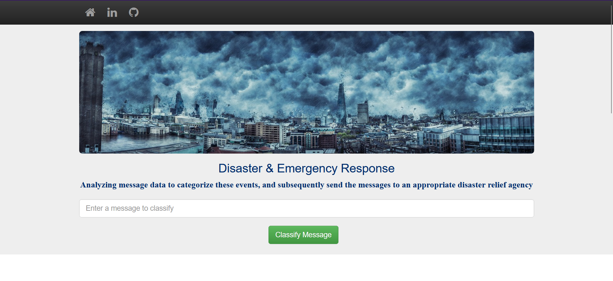
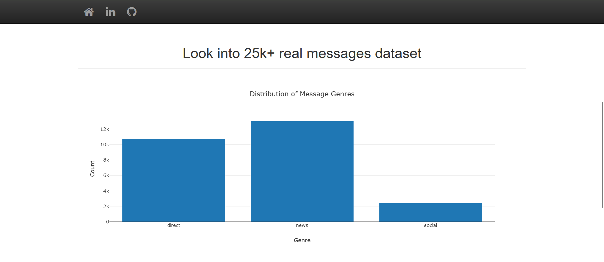
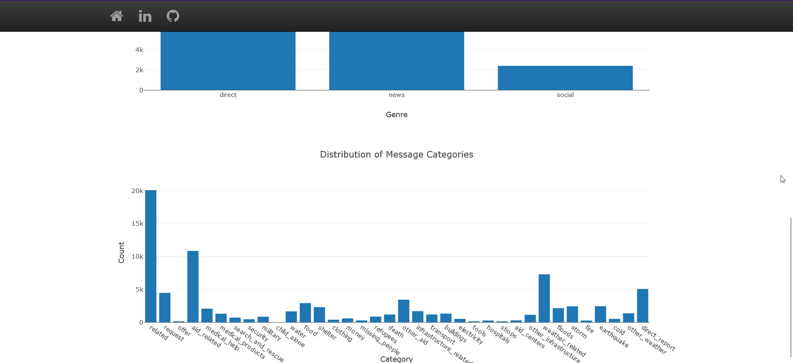
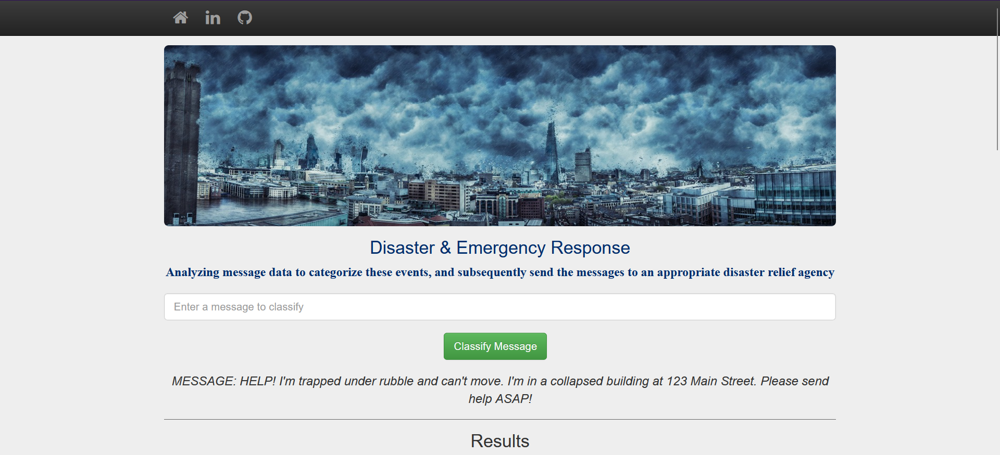
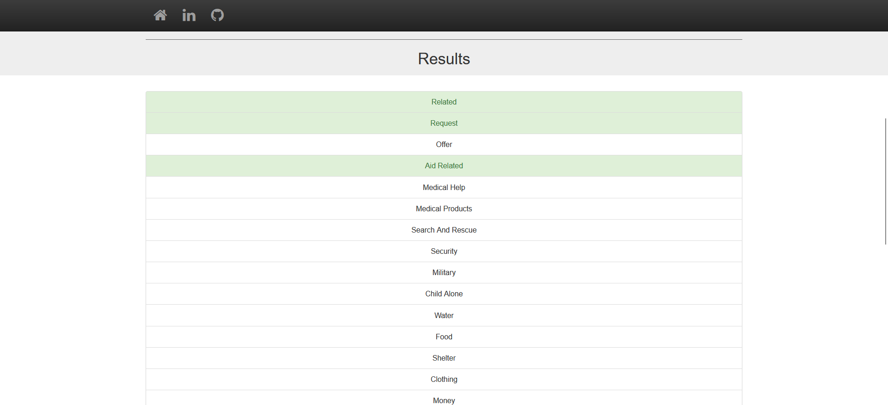

<h3 align="center">Disaster Emergency Response</h3>

<p align="center">
  Analyzing message data to categorize these events, and subsequently send the messages to an appropriate disaster relief agency
  <br>
  <a href="https://www.kaggle.com/datasets/sidharth178/disaster-response-messages?select=disaster_categories.csv"><strong>Explore Figure Eight Dataset »</strong></a>
</p>

https://user-images.githubusercontent.com/74235084/224092245-bc61bada-c525-436f-926c-677484457597.mp4

## Table of Contents
1. [Installation](#installation)
2. [Project Motivation](#motivation)
3. [File Descriptions](#files)
4. [Results](#results)
5. [Licensing, Authors, and Acknowledgements](#licensing)

## Installation <a name="installation"></a>
To install this project and its dependencies, follow these steps:
1. If you haven't already, install poetry by running the following command:
```
curl -sSL https://raw.githubusercontent.com/python-poetry/poetry/master/get-poetry.py | python -
```
Alternatively, you can install poetry using pip:
```angular2html
pip install poetry
```
2. Clone this repository:
```angular2html
git clone https://github.com/tmkhang1999/Disaster-Emergency-Response.git
```
3. Install the project's dependencies with poetry:
```angular2html
poetry install
```
This will create a new virtual environment for the project and install all of its dependencies, using the information from the poetry.toml and poetry.lock files in the project directory.
4. Set up the database, train model and save the model:
```angular2html
python data/etl_pipeline.py data/disaster_messages.csv data/disaster_categories.csv data/DisasterResponse.db response
```
```angular2html
python models/ml_pipeline.py data/DisasterResponse.db response models/model.joblib
```
5. Run the web app
```angular2html
python app.py
```
Then go to http://0.0.0.0:8080/

## Project Motivation<a name="motivation"></a>
The motivation for this project is to help emergency workers quickly and efficiently respond to disasters by creating a natural language processing (NLP) pipeline that can categorize messages sent during a disaster event. By using pre-labelled tweets and messages from real-life disasters, we aim to build a machine learning model that can accurately classify messages in real-time, enabling emergency workers to quickly identify and prioritize the most urgent needs.

The outcome of this project is a web app that can be used by emergency workers to input new messages and receive classification results in several categories. In addition, the web app will display visualizations of the data, allowing emergency workers to easily identify trends and patterns in the data.

By building this NLP pipeline and web app, we hope to improve the response time and effectiveness of disaster relief efforts. This project will provide valuable insights into the use of NLP and machine learning in disaster response and can be applied to future disaster events to help save lives and provide critical aid to those in need.

## File Descriptions <a name="files"></a>
```angular2html
├── README.md
├── poetry.lock *** The dependencies we need to install
├── pyproject.toml
├── app
│   ├── templates *** HTML templates
│   ├── __init__.py
│   ├── modules.py
│   ├── utils.py
├── data
│   ├── disaster_categories.csv
│   ├── disaster_messages.csv
│   ├── etl_pipeline.py *** Used to clean the dataset
├── models
│   ├── ml_pipeline.py *** Used to train and save model
├── Dockerfile *** Building Docker Image
└── app.py *** See the results by running this app
```

## Results<a name="results"></a>







## Licensing and Acknowledgements<a name="licensing"></a>
[Udacity](https://www.udacity.com/) for providing an amazing Nanodegree Program in Data Science.

[Figure  Eight](https://appen.com/) for providing the training messages dataset.

The code in this repository is released under MIT License.

